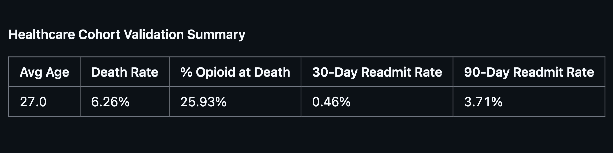
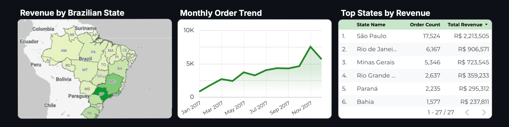
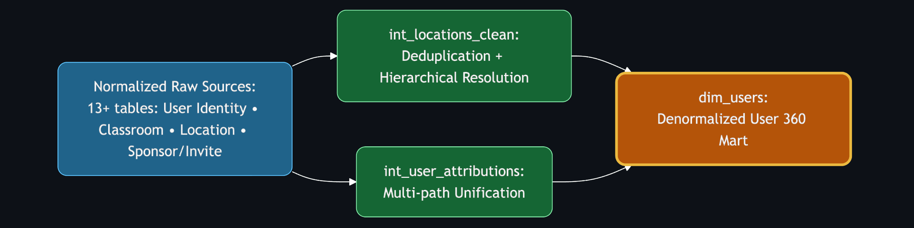
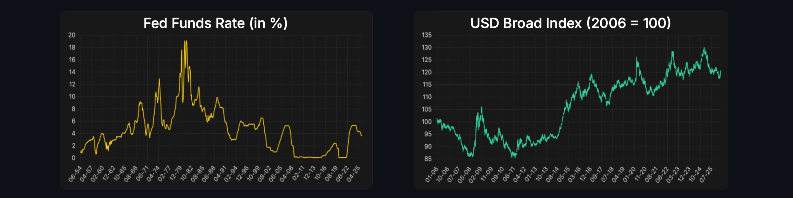

  <h1>
    Hi, I'm Corin ("ker-RIN")
  </h1>

<h4>✦ Data Analyst ✦</h4>

  

    
  

### About Me

I turn complex datasets into clear, decision-ready stories through rigorous cleaning, validation, and thoughtful analysis. Committed to reproducible workflows, thorough testing, and presenting findings in ways that directly support business priorities and stakeholder understanding.

  

### 🚀 Featured Projects

End-to-end projects solving real problems — from messy raw data to trusted, impactful analytics.

---

**⚕️ [Healthcare Analytics (SQL)](https://github.com/space-lumps/healthcare-analytics-sql)**

<!-- Responsive banner that automatically switches between dark and light mode -->
<!-- GitHub uses the user's system preference or GitHub theme setting -->
<picture>
  <!-- Dark mode version (shown first because most GitHub users are in dark mode) -->
  <source media="(prefers-color-scheme: dark)" srcset="assets/images/healthcare-analytics-dark.png">
  
  <!-- Light mode version -->
  <source media="(prefers-color-scheme: light)" srcset="assets/images/healthcare-analytics-light.png">
  
  <!-- Fallback image (dark version) for older browsers or when media queries aren't supported -->
  
</picture>

**Business Value**  
Enables clinical operations and quality teams to identify overdose cohorts, readmission risks, and opioid patterns — supporting targeted interventions, better resource use, and outcome monitoring.

**Tools** · SQL, PostgreSQL, window functions, QA validation

**Highlights**
- Precise encounter-level cohorts with clinical filters
- Risk feature engineering (readmits, meds, mortality flags)
- Built-in data quality checks for audit reliability

---

**🛒 [Ecommerce Data Cleaning Pipeline](https://github.com/space-lumps/ecommerce-data-cleaning)**

<!-- Responsive banner that automatically switches between dark and light mode -->
<!-- GitHub uses the user's system preference or GitHub theme setting -->
<picture>
  <!-- Dark mode version (shown first because most GitHub users are in dark mode) -->
  <source media="(prefers-color-scheme: dark)" srcset="assets/images/ecommerce-data-dark.png">
  
  <!-- Light mode version -->
  <source media="(prefers-color-scheme: light)" srcset="assets/images/ecommerce-data-light.png">
  
  <!-- Fallback image (dark version) for older browsers or when media queries aren't supported -->
  
</picture>

**Business Value**
Establishes a clean, trustworthy data foundation for sales, customer, and ops reporting — eliminating downstream errors in trends, segmentation, and forecasting.

**Tools** · Python, pandas, pytest, GitHub Actions, parquet

**Highlights**
- Modular pipeline with separation of concerns
- Schema enforcement and validation
- Automated tests + profiling reports
- Full portfolio structure: docs, data dictionary, samples

---

**👤 [User 360 Dimension (dbt + BigQuery)](https://github.com/space-lumps/bigquery-dbt-user-dimension)**

<!-- Responsive banner that automatically switches between dark and light mode -->
<!-- GitHub uses the user's system preference or GitHub theme setting -->
<picture>
  <!-- Dark mode version (shown first because most GitHub users are in dark mode) -->
  <source media="(prefers-color-scheme: dark)" srcset="assets/images/user-360-dark.png">
  
  <!-- Light mode version -->
  <source media="(prefers-color-scheme: light)" srcset="assets/images/user-360-light.png">
  
  <!-- Fallback image (dark version) for older browsers or when media queries aren't supported -->
  
</picture>

**Business Value**
Provides a single trusted user view for acquisition ROI, LTV segmentation, churn risk by channel/location — powers marketing optimization and retention.

**Tools** · dbt, BigQuery, SQL, YAML, CI/CD

**Highlights**
- Geospatial hierarchy + multi-path attribution
- Comprehensive schema tests and quality checks
- Modular, BI-ready models

---

**💹 [Macroeconomic Financial Indicators Dashboard](https://space-lumps.github.io/macro-financial-indicators/)**

<!-- Responsive banner that automatically switches between dark and light mode -->
<!-- GitHub uses the user's system preference or GitHub theme setting -->
<picture>
  <!-- Dark mode version (shown first because most GitHub users are in dark mode) -->
  <source media="(prefers-color-scheme: dark)" srcset="assets/images/macro-indicators-dark.png">
  
  <!-- Light mode version -->
  <source media="(prefers-color-scheme: light)" srcset="assets/images/macro-indicators-light.png">
  
  <!-- Fallback image (dark version) for older browsers or when media queries aren't supported -->
  
</picture>

**Business Value**
Tracks liquidity, yields, volatility, and USD strength to contextualize crypto/investment timing and risk — highlights macro tailwinds/headwinds.

**Tools** · JavaScript, Chart.js, automation, static site

**Highlights**
- Time-series charts with crypto-relevant explanations
- Daily automated updates
- Clean, public-facing design

  

#### Languages

#### Data Libraries

#### BI & Visualization Tools

#### Cloud & Data Platforms

#### Version Control & CI/CD

 

  

 

  

   
  <strong>Seeking roles:</strong>  
  <picture></picture>
  <picture></picture>
  <picture></picture>  
  <em>Exploring opportunities to deliver reliable data insights, support decision-making, and improve processes. Reach out on LinkedIn — happy to connect!</em> 👋

 

  
  <picture></picture>

